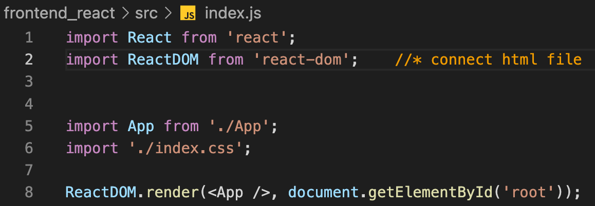

# PRE-START
1. install:   
`sudo npm install -g @sanity/cli`  
`sanity init --coupon javascriptmastery2022`  
2. Login, then, give the project a name, then, create a dataset [FINISH THE SETUP]  


3. > Success! Now what?  

   
   >▪ sanity docs to open the documentation in a browser  
   ▪ sanity manage to open the project settings in a browser  
   ▪ sanity help to explore the CLI manual  
   ▪ sanity start to run your studio  

4. After `sanity start`
    >✔ Checking configuration files...    
    ⠙ Compiling...webpack built d0a3c8c0b9c9e92e1fe7 in 11289ms  
    ✔ Compiling...  
    Content Studio successfully compiled! Go to http://localhost:3333 

    Reach Sanity Desk.

***

# Backend
## In backend_sanity/schemas folder
1. Create a testimonials.js file, implement a schema.  
2. Import it in the backend_sanity/schemas/schema.js.
   14:30

    `tree -L 2`


    > **.**<br>
    > ├── LICENSE<br>
    > ├── README.md<br>
    > ├── STEP-1.md<br>
    > └── backend_sanity<br>
    > &emsp;&emsp;&emsp;&emsp;├── README.md<br>
    > &emsp;&emsp;&emsp;&emsp;├── config<br>
    > &emsp;&emsp;&emsp;&emsp;├── node_modules<br>
    > &emsp;&emsp;&emsp;&emsp;├── package.json<br>
    > &emsp;&emsp;&emsp;&emsp;├── plugins<br>
    > &emsp;&emsp;&emsp;&emsp;├── sanity.json<br>
    > &emsp;&emsp;&emsp;&emsp;├── schemas&emsp;&emsp;&emsp;&emsp;(--About schemas--)<br>
    > &emsp;&emsp;&emsp;&emsp;├── static<br>
    > &emsp;&emsp;&emsp;&emsp;├── tsconfig.json<br>
    > &emsp;&emsp;&emsp;&emsp;└── yarn.lock<br>
    
    Change more to make this part my own one { just in /schemas }


# Frontend 
1. initialize react application
2. `npx create-react-app frontend_react` 
   

    > 174 packages are looking for funding run `npm fund` for details      
      Installing template dependencies using npm...<br>
      npm WARN deprecated source-map-resolve@0.6.0: See https://github.com/lydell/source-map-resolve#deprecated   
      Removing template package using npm...<br>
      To address all issues (including breaking changes), run:     
      > `npm audit fix --force`   

      Run `npm audit` for details.   


    > Inside that directory, you can run several commands:
      >- `npm start`<br>
      >Starts the development server.<br>
    
      >- `npm run build`
      >Bundles the app into static files for production.
    
      >- `npm test`
      >Starts the test runner.
    
      >- `npm run eject`
      >Removes this tool and copies build dependencies, configuration files
      >and scripts into the app directory. If you do this, you can’t go back!


   We suggest that you begin by typing:   
      >- `cd frontend_react`
      >- `npm start`

## Basically, in <br>  frontend_react/src 
   - index.js (only import react here)
      

   - App.js
      with ES7+ React/Redux/React-Native snippets
   
      `rafce`

   - index.css
   
      > https://github.com/adrianhajdin/project_professional_portfolio/blob/master/src/index.css

In frontend_react:  
`npm install @sanity/client @sanity/image-url framer-motion node-sass react-icons`

   - Before next step:  
      >./src  
      ├── App.js  
      ├── assets  
      ├── components  
      ├── constants  
      ├── container  
      ├── index.css  
      └── index.js  
   - In container/  
       Several Larger Components with both .jsx and .scss file

   - In .jsx file:<br>
      `rafce`

   - Import those containers in the App.js
   - Export in the index.js

   - Same should be done in the components/Navbar
- Get App.scss from https://github.com/adrianhajdin/project_professional_portfolio/blob/master/src/App.scss
- Get assets in https://minhaskamal.github.io/DownGit/#/home?url=https:%2F%2Fgithub.com%2Fadrianhajdin%2Fproject_professional_portfolio%2Ftree%2Fmaster%2Fsrc%2Fassets
- Get constants/images.js from https://github.com/adrianhajdin/project_professional_portfolio/blob/master/src/constants/images.js
- With constants we can import all iamges in just an object

   <mark>Stupid Spelling Bug 'src'</mark>  
   logo: https://www.brandcrowd.com/maker/logos/page3?Text=Guo%20Siqi&SearchText=programmer&LogoStyle=0 ($)
---

### Now turn to Navbar (.js file)
Focus:
   1. img src 

   2. ul unordered list  
      - Tips: https://www.devbridge.com/articles/implementing-clean-css-bem-method/ (38:32) 

   3. add className to nav, div, ul, li,

   4. More in Navbar.scss  
      - `background: rgba(255, 255, 255, 0.25);`
      - `z-index: 2;` => above the content
      - `@media screen and (min-width: 2000px) {    
        width: 180px;  
        height: 40px;  
        }` => media query inside specific classes
      - `a {
          color: var(--gray-color);
        }` => reuse from src/index.css
      - `&:hover {
              color: var(--secondary-color);
          }` just in li{ a{} }
      
   5. menu, here Framer Motion: https://www.framer.com/motion/

   6. just in Navbar.scss:
      ```scss
      @media screen and (max-width: 900px) {
        display: none;
      }
      ```
      
      => trigger a specific menu
      
      - - motion div (scss in .app__navbar-menu)
      
        - ```scss
          svg {
                  width: 35px;
                  height: 35px;
                  color: var(--secondary-color);
                  margin: 0.5rem 1rem;
              }
          ```
      
          => For Big close icon   in .jsx file : `<HiX onClick={() => setToggle(false)} />`     

   Now basically, navbar 'menu' has been built


---

### Now turn into Header (.jsx file) (1:09:16)   
#### To show Header, `{ /* <Navbar /> */}`  to just cover Navbar
   1. <mark>marginLeft Spell bug again <mark>  
   2. After doing some motion.divs and scaleVariants, let Navbar back
   3. <mark>Pay attention to the size you zoom in<mark>
   4. <mark>Check className<mark>

```scss
.app__header-img {
  flex: 1;
  height: 100%;
  display: flex;
  justify-content: flex-end;
  align-items: flex-end;
  position: relative;
  img {
      width: 100%;
      object-fit: contain;
      z-index: 1;
  }
  .overlay_circle {
      position: absolute;
      left: 0;
      right: 0;
      bottom: 0;
      z-index: 0;
      width: 200%;
      height: 190%;
  }
}
```
Confused
But I got super cool results!

***
STEP-1 Ends