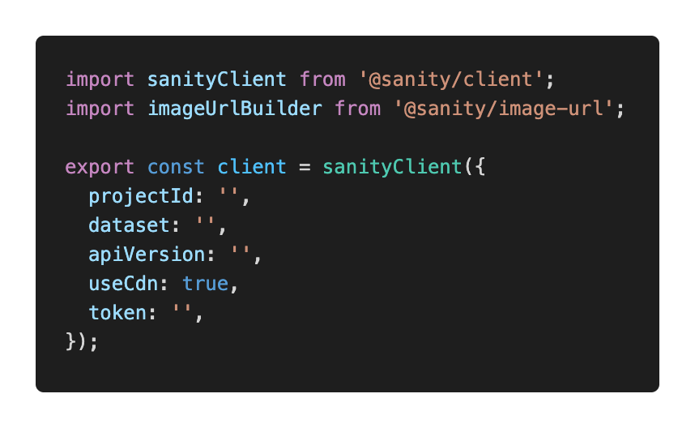
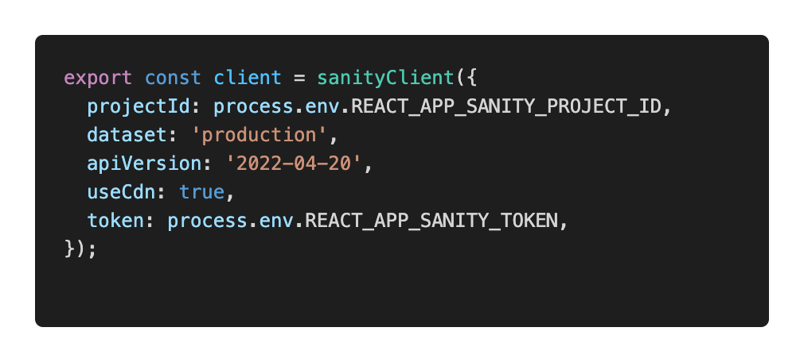
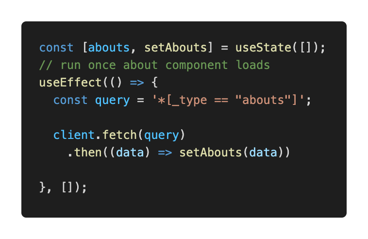
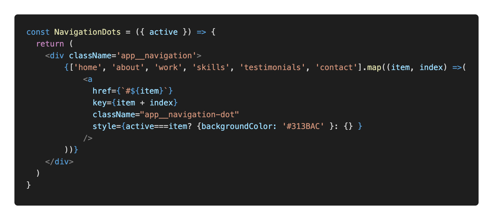
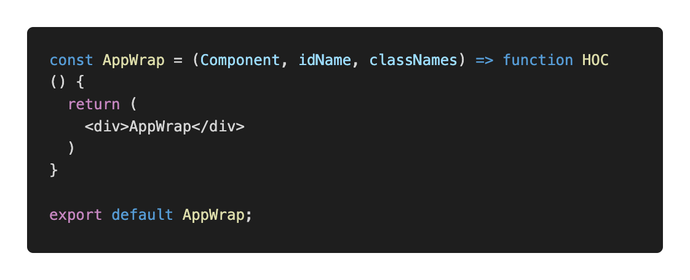
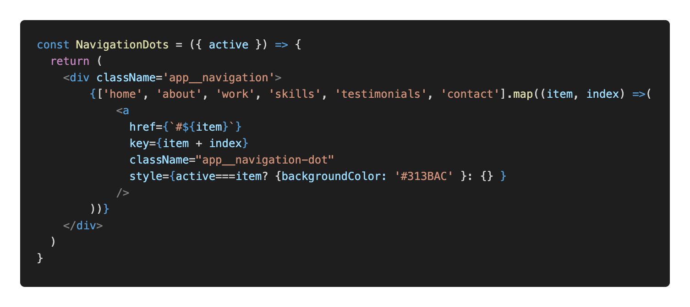

## Start coding out “About” Section
Turn to About.jsx file and .scss file
## How to modify data in the frontend using sanity CMS
Connect sanity to react application
- Create client.js in the /frontend_react/src/ 
    - Connect sanity client to react application
    
    
- Turn to backend_sanity  
    - `sanity manage`
    - CORS origins add http://localhost:3000/ with credentials
    - `const builder = imageUrlBuilder(client);`
    - `export const urlFor = (source) => builder.image(source);`
    - Just use these two, whenever working with sanity
- To keep save data like token safe 
    - in frontend_sanity/ create a new file .env
    

- Now, client can fetch real data from sanity dashboard
---

## Now, in frontend_react/src, use react and sanity to fetch real dynamic data from a CMS
   - import client and  
   
   - Now, empty in where there is static data 
   - Next, (1:52:09) Deal with data after `sanity start`
   - Fixed one image thing: `img src={about.imgUrl}` => `img src={urlFor(about.imgUrl)}`
   - Reload the frontend page

***

## Higher order component: (height-all-screen and media icons and scrolls...)
Wrap all sections with a react higher order component.  
Reuse component.  
In src/wrapper, import `NavigationDots, SocialMedia`, so create NavigationDots.jsx and SociaMedia.jsx in components/

NavigationDots:
   

Then, convert wrap into high order component. Use return function HOC():  
   
In const AppWrap HOC function: 
    
Deal with import and export issues.  
How to use AppWrap?  

For instance: in Header.jsx: `export default Header` => `export default AppWrap(Header, 'home');` and div id='home' can be just in AppWrap()  
Do similar thing to other components.  

