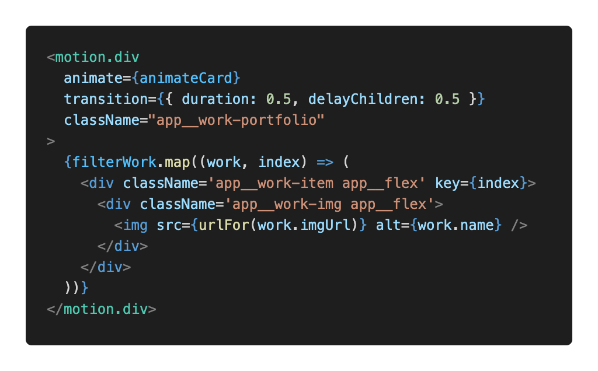
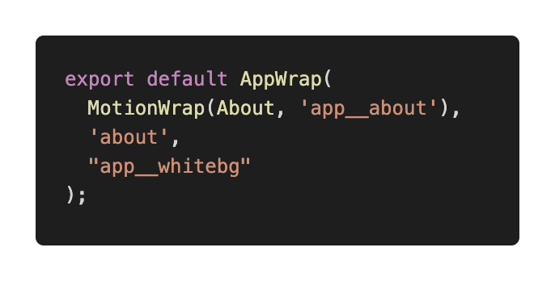

## Start coding out “About” Section
Turn to About.jsx file and .scss file
## How to modify data in the frontend using sanity CMS
Connect sanity to react application
- Create client.js in the /frontend_react/src/ 
    - Connect sanity client to react application
    
    
- Turn to backend_sanity  
    - `sanity manage`
    - CORS origins add http://localhost:3000/ with credentials
    - `const builder = imageUrlBuilder(client);`
    - `export const urlFor = (source) => builder.image(source);`
    - Just use these two, whenever working with sanity
- To keep save data like token safe 
    - in frontend_sanity/ create a new file .env
    

- Now, client can fetch real data from sanity dashboard
---

## Now, in frontend_react/src, use react and sanity to fetch real dynamic data from a CMS
   - import client and  
   
   - Now, empty in where there is static data 
   - Next, (1:52:09) Deal with data after `sanity start`
   - Fixed one image thing: `img src={about.imgUrl}` => `img src={urlFor(about.imgUrl)}`
   - Reload the frontend page

***

## Higher order component: (height-all-screen and media icons and scrolls...)
Wrap all sections with a react higher order component.  
Reuse component.  
In src/wrapper, import `NavigationDots, SocialMedia`, so create NavigationDots.jsx and SociaMedia.jsx in components/

NavigationDots:
   

Then, convert wrap into high order component. Use return function HOC():    
     
In const AppWrap HOC function:   
     
Deal with import and export issues.  
How to use AppWrap?  

For instance: in Header.jsx: `export default Header` => `export default AppWrap(Header, 'home');` and div id='home' can be just in AppWrap()  
Do similar thing to other components.  

## Work/ Research Experience:
- First: 
    
- Pay attention: function and useState:  
    
    - Then with:    
          
        and  
          
        (2:19:33)
    - Below img, a motion.div
- Deal with scss and next step is to fix the handleWorkFilter:    
    

---

## Skills Section:
Here, install `npm install react-tooltip`
In Skills.jsx, create useState and useEffect:  
   -   
And build the simple frame:  
   -   
Do with scss file.  
Then, after doing skills parts, continue to code experience(Awards) parts.  

- <mark>Experience Bug:<mark>

   - 
   - Tips: (3:06:10)   
      - `experience?.works?.map((work) => ()`
      - Debug2: 
      - Year exists.
      
    - <mark>Explain: year can not be the unique key, so map once to map year and map a second time to map the work<mark> 
      

- Back to scss file: add experience things  
(Skills circle colors can be changed `
`)  
***

## Before turning into next section, author proposed one higher order component to make animation once scrolling!
In frontend_react/src/wrapper/MotionWrap.js
After export in the wrapper/index.js.  
Import them in each jsx file of each component.

*** 

## Testimonial Section ... For me, (∂) no need for now, I suppose ...
Similar to recommendation?  
## Contact Footer Section (3:51:00)
- Build the frame of jsx file
- deal with the state and 'handle' functions  
(4:00:00)
- Handle functions
    
- Implement the styles.  
- (command + space)
- Now, when message sent, it will be sent directly to sanity

---

### favicon on the top and the name of the site
easy: frontend_react/public/index.html     
## Deploy this.
> In /frontend_react  
`npm run build`

- https://www.netlify.com/
- Sign up, and drag the build folder in the frontend_react into it(deploy manully) 
    
- Turn to backend_sanity/ and `sanity manage` in API CORS origins
- Add ORIGIN.

> https://app.netlify.com/sites/gsqportfolio/settings/domain  

Come to https://gsqportfolio.netlify.app/